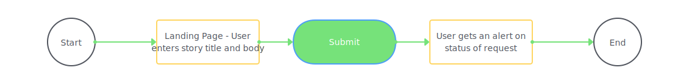

# Threader

A twitter bot which creates threads when given a story or rant as input

## Objectives

1. Build a frontend interface in React for taking a user's story
2. Use fetch or async await to interact with twitter Api
  - Create tweet objects
  - Creat a twitter thread with tweet objects

## Details

### Dependencies

- Twitter API key of the account that will be posting the tweets

### User Flow

_This is a student project that was created at [CodeOp](http://CodeOp.tech), a full stack development bootcamp in Barcelona._
