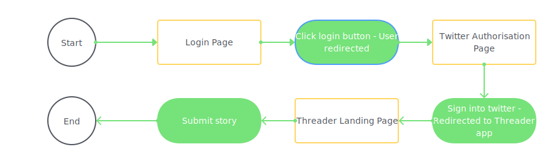
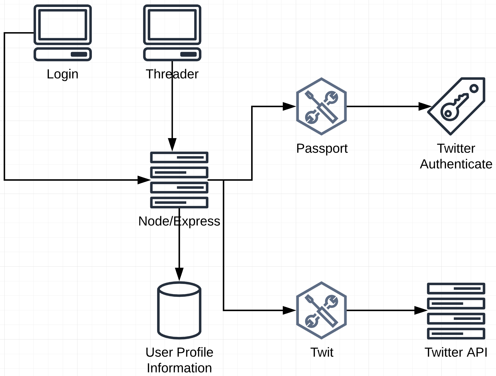
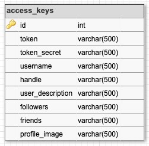
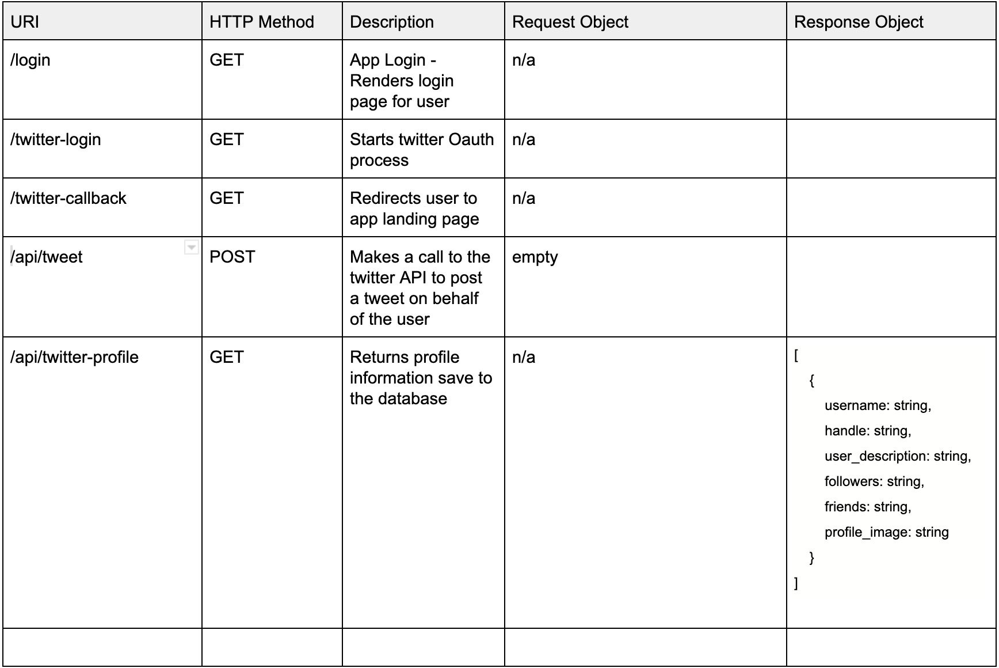

# Threader

A twitter bot which creates threads when given a story or rant as input

## Objectives

1. Build a frontend interface in React for taking a user's story
1. Use fetch or async await to interact with twitter Api
   1. Connect to twitter API with API key
   1. Create tweet objects
   1. Create a twitter thread with tweet objects

## Deatils

### Dependencies

- Twitter API key of the account that will be posting the tweets
- [PassportJS](<http://www.passportjs.org/>) - for user authentication
- [Twit](<https://www.npmjs.com/package/twit>) - to interface with [Twitter Api](<https://developer.twitter.com/en>)

### Setup

#### Getting API Keys from Twitter

1. Sign up for a free Twitter account with your email [here](<https://twitter.com/i/flow/signup>)
2. Make sure to verify your account. They'll send an email verification when you sign up
3. Apply for a Twitter developer account with the Twitter account you just created [here](https://developer.twitter.com/en)
4. Create a 'twitter app' in the developer dashboard [here](https://developer.twitter.com/en/apps). You can read more about getting started with the developer account [here](https://developer.twitter.com/en/account/get-started)
5. In the details of the app, enable `Sign in with Twitter` and add `http://127.0.0.1:5000/twitter-callback` as a Callback URL
6. After creating the app, you can access your API keys under the 'Keys and Tokens' tab in the details view of your twitter app

#### Dependencies

1. After cloning this repository, run `yarn`in the root folder to install express dependencies
2. `cd client` and run `npm install` to install React dependencies

#### Database Prep

1. Rename the `.env.example` file in the project root to `.env`
2. Replace the values with your own actual values EXCEPT `DB_NAME`
3. Type `mysql -u root -p` to access the MySQL CLI using your password.
4. In the MySQL CLI, type `create database twitter;` to create a database in MySQL.
5. Exit the MySQL CLI and run `npm run migrate` in your **TERMINAL**, in the **root** folder of your project (not your MySQL CLI!). This will create a table called 'access_keys' in your twitter database.

#### Run Development Servers

1. Run `yarn start` in project directory to start the Express server on port 5000
2. `cd client` and run `npm start` to start client server in development mode with hot reloading in port 3000.

#### App Usage

1. The app starts with a login page served from express at <http://localhost:5000/login>
2. This eventually redirects to the app page in express on <http://localhost:3000/>

### User Flow

_This is a student project that was created at [CodeOp](http://CodeOp.tech), a full stack development bootcamp in Barcelona._

### Architecture

#### Structure

#### Database Schema

#### API Routes

### Future Roadmap

#### Title Input

The app should also take the title of the story and make that the first tweet in a thread and append '- A thread' to it. For example, if the title of a story is "Little Red Riding Hood", the first tweet in the thread will be "Little Red Riding Hood - A thread". The rest of the tweets in the thread will be the story

#### Modals

After a user submits a story, the app should show a modal giving feedback (success or failure) to the user on whether the thread has been posted or not.

#### React Login

The login page is currently in a .ejs file in the views folder `views/login.ejs`. I'd like to make a React page which redirects to the `/twitter-login` route of the express server

#### Saving User Stories

I'd like to save user information as well as the stories they've shared in a database and show twitter stats on the stories they've posted. So everytime they log into the app, they'll see a list of the stories they've written and posted as well as the twitter statistics on these stories
